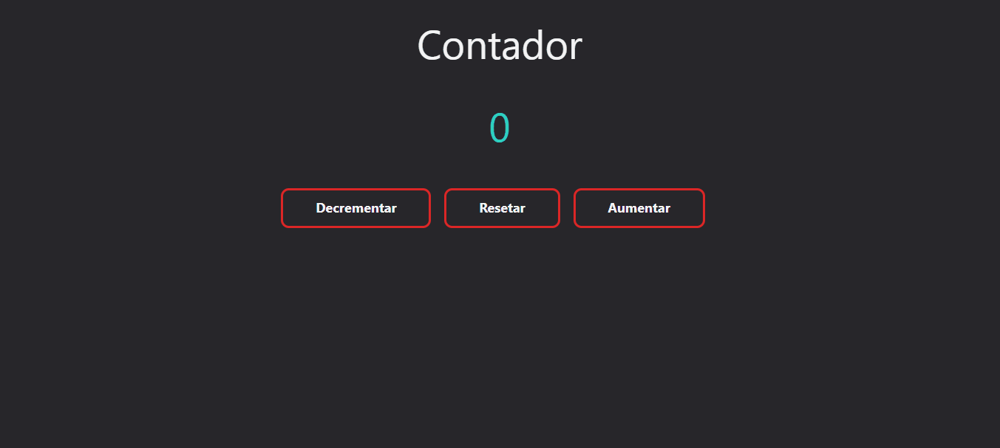

<h1 align="center">
    
    </br>
    Contador Simples
</h1>

<p align="center">Projeto de um Contador com <a href="https://www.typescriptlang.org/">Typescript</a> e <a href="https://tailwindcss.com/docs/installation">Tailwind CSS</a></p>

## 💡 Tecnologias Usasdas
<ul>
<li>TypeScript
<li>Tailwind CSS
<li>Post CSS
</ul>
</br>
<h3>Instalação Tailwind CSS</h3>

```
with npm
npm install -D tailwindcss

with npx
npx tailwindcss init
```

<h3>Instalação Post CSS</h3>

```
with npm
npm install -D tailwindcss postcss autoprefixer

with npx
npx tailwindcss init -p
```


## 🖥️ Demo
<div align="center">
    
</div>

<hr />
<p>Alerrando © 2022 Obrigado por acessar</p>