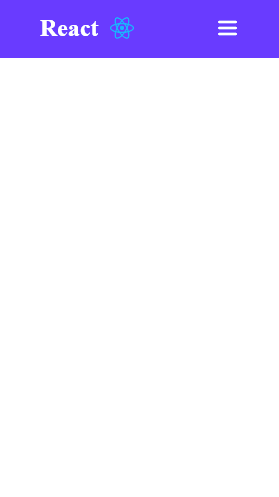

<h1 align="center">
    
     
    Navbar
</h1>

Projeto de uma Navbar usando <a href="https://www.typescriptlang.org/">Typescript</a>

## 💡 Tecnologias Usasdas
<ul>
<li>TypeScript
</ul>
 

## 🖥️ Demo

    

Alerrando © 2022 Obrigado por acessar
