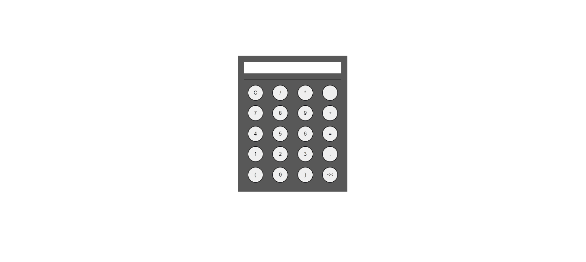
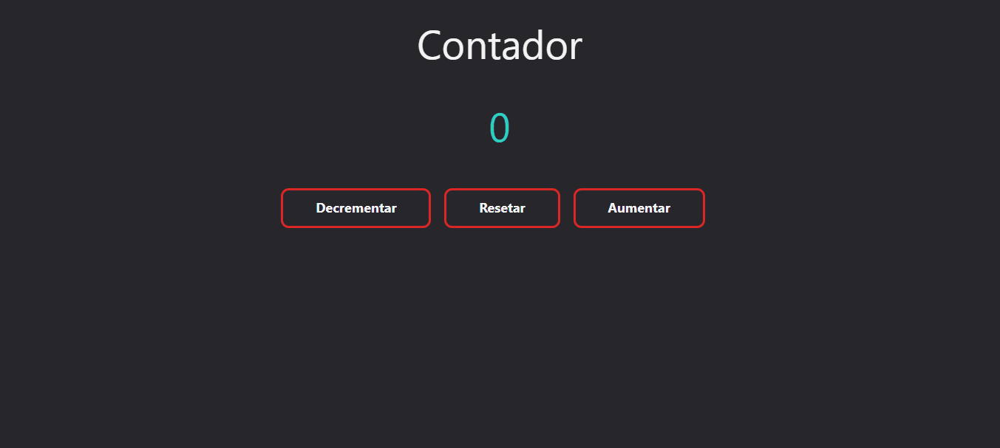

<p>Todos os projetos foram criados usando o <a href="https://vitejs.dev/guide/">Vite</a></p>

## `npm run dev`
Executa o aplicativo no modo de desenvolvimento.<br />
Abra [http://127.0.0.1:5173/](http://127.0.0.1:5173/) para vê-lo no navegador.

A página será recarregada se você fizer edições.
Você também verá quaisquer erros de fiapos no console.</p>
<hr>

## Métodos de criação
<br>
Com NPM:

```
$ npm create vite@latest
```

Com Yarn:
```
$ yarn create vite
```

Com PNPM:
```
$ pnpm create vite
```
</br>
<h3>Caso queira especificar o nome do projeto e o modelo, você pode utilizar comandos adicionais. Um exemplo com Vite + Vue:</h3>

```
# npm 6.x
npm create vite@latest my-vue-app --template vue

# npm 7+, extra double-dash is needed:
npm create vite@latest my-vue-app -- --template vue

# yarn
yarn create vite my-vue-app --template vue

# pnpm
pnpm create vite my-vue-app --template vue
```
<hr>

## 🖥️ Projetos Demos
<br/>

### Calculadora
<div align="center">
    
</div>

<br/>

### Contador Simples
<div align="center">
    
</div>

<br/>

### Controle de Temperatura
<div align="center">
    
</div>

<br/>

### Formulário
<div align="center">
    
</div>

<br/>

### Navbar
<div align="center">
    
</div>

<br/>

### Notes App
<div align="center">
    
</div>

<br/>

### Shopping List
<div align="center">
    
</div>

<br/>

### To Do
<div align="center">
    
</div>

### Quiz
<div align="center">
    
</div>

<br/>

<hr />
<p>Alerrando © 2022 Obrigado por acessar</p>